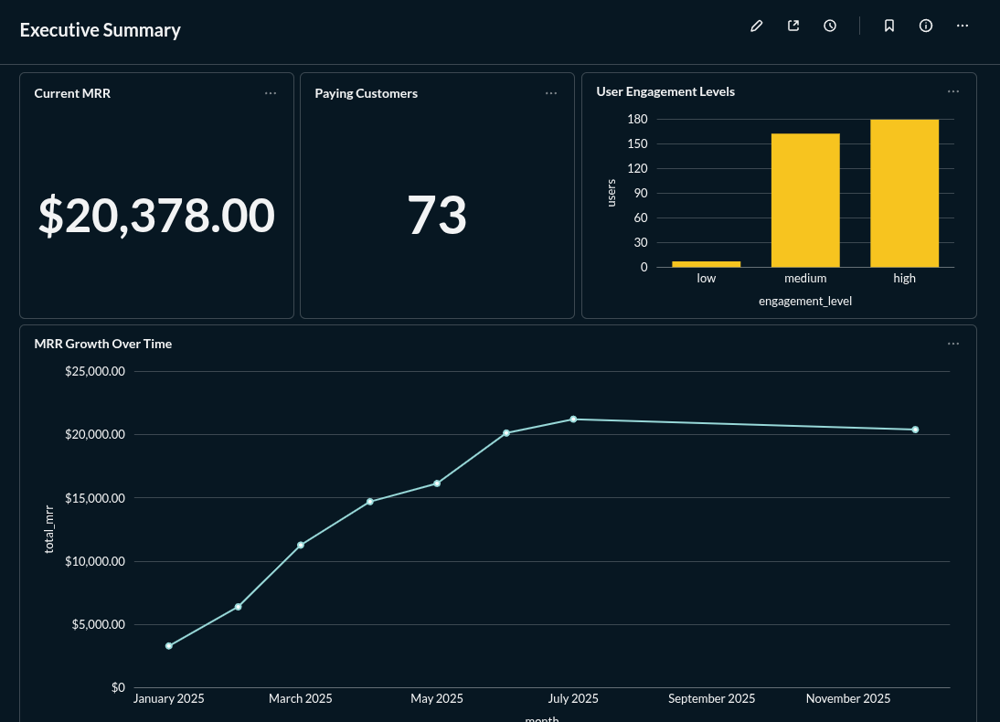
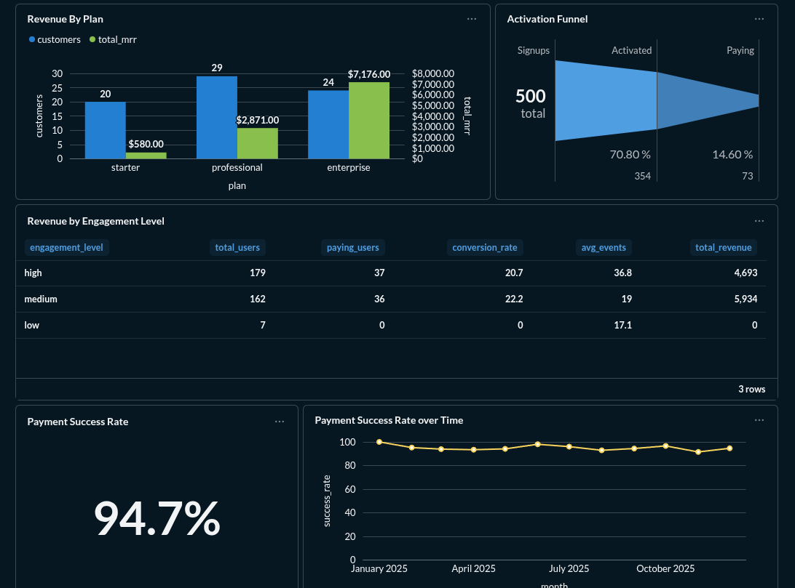
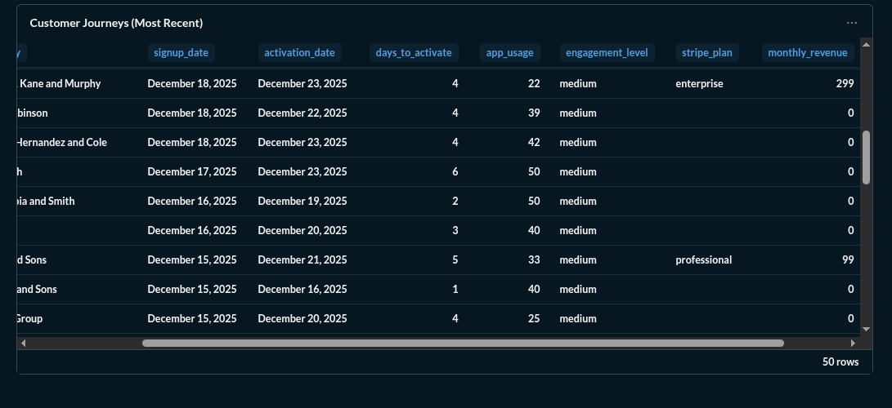

# 💼 Fully-Containerized, Production-Ready Data Stack for SaaS Startups

[](https://opensource.org/licenses/MIT)
[](https://www.postgresql.org/)
[](https://www.getdbt.com/)
[](https://www.docker.com/)
[](https://www.metabase.com/)

Newly-created startups are like baby gazelles, deposited unceremoniously on the savannah with the clock ticking. You have to learn to stand up and run as quickly as possible, or you're lunch. 

You've got users signing up, revenue coming in, and maybe you're even collecting event data, but at the same time your team is limping along on Google Sheets, exporting CSVs, and manually calculating metrics for leadership.

If this is you, you need a rudimentary data stack - functional, accurate and cheap - and you need it now. 


# The Typical "Solutions" (That Don't Work)

❌ **Hire a data team** - You're pre-Series B. You can't afford $300K+ for engineers + analysts  
❌ **Buy expensive SaaS tools** - Segment ($120K/year) + Looker ($60K/year) + Fivetran ($30K/year) = $210K before you've answered a single question  
❌ **Wait until later** - Meanwhile, you're burning cash on marketing channels that don't convert and missing your best growth levers


## What This Project Gives You (Today)



**A complete, production-ready data stack, complete with visualizations.**



✅ **Runs in 15 minutes** - `docker compose up -d` and you're live  
✅ **Costs $0** - Everything is open-source (PostgreSQL, dbt, Metabase)  
✅ **Answers real questions** - Pre-built metrics for activation, conversion, MRR, cohorts, LTV  
✅ **Works with your tools** - Grabs your raw data from Google Sheets, pulls payments from a mocked-up Stripe API, and builds you a data warehouse  
✅ **Scales with you** - From 500 to 500K users without rewriting



Employs modern data engineering practices. Built to showcase real-world SaaS data pipeline architecture with separation of application data and payment processing. Designed, constructed, and iteratively upgraded over 4 days with Claude.ai.

**Live Cost:** $0 (locally-hosted development) | **Production Cost:** ~$30-75/month (Airbyte API connectors, DigitalOcean droplet)

**Everything runs in Docker containers** - just `docker compose up -d` and you're done.

## Get Started
```bash
git clone https://github.com/YOUR_USERNAME/startup-data-stack
cd startup-data-stack
# Add your Google credentials
docker compose up -d
# 15 minutes later: your data stack is live
```

## 📊 Architecture
```
Google Sheets (user data) | Simulated Stripe API (payments data)
    ↓ (Simulated Airbyte sync every 6 hours)
PostgreSQL (taskflow_production)
    ↓ (dbt transformations)
Analytics Data Warehouse (8 models)
    ↓ (SQL queries)
Metabase Dashboards (25+ queries)
```

## Setup Steps

1. **Clone repository**
```bash
   git clone https://github.com/YOUR_USERNAME/startup-data-stack.git
   cd startup-data-stack
```

2. **Get Google Sheets API credentials**
   
   Quick steps:
   - Create Google Cloud project
   - Enable Google Sheets API + Drive API
   - Create service account → Download JSON credentials
   - Save as `google-credentials.json` in project root
   - Create "TaskFlow App Data" Google Sheet with `Users` and `Events` tabs
   - Share sheet with service account email

3. **Start the stack**
```bash
   docker compose up -d
   # Wait 60 seconds for all services to start
```

4. **Populate Google Sheets** (one-time)
```bash
   docker exec data-sync-service /app/entrypoint.sh populate-sheets
   # Generates 500 sample users + 9,789 events
```

5. **Run initial sync**
```bash
   docker exec data-sync-service /app/entrypoint.sh sync-only
   # Syncs data and runs dbt transformations
```

6. **Verify pipeline**
```bash
   docker exec taskflow-production-db psql -U taskflow -d taskflow_production -c "
   SELECT COUNT(*) FROM analytics.fct_user_metrics;
   "
   # Should return: 500
```

7. **Access Metabase**
   - Open: http://localhost:3000
   - Create account (local only)
   - Add database: `taskflow-production-db:5432/taskflow_production`
   - Use queries from `metabase-queries/` folder
   
## ✅ Verification Checklist

After setup, you should have:

- ✅ **6 services running healthy** (`docker compose ps`)
- ✅ **500 users** in Google Sheets & PostgreSQL
- ✅ **9,789 events** synced
- ✅ **200 Stripe customers** (generated from user emails)
- ✅ **80 subscriptions** ($10,627 MRR)
- ✅ **8 dbt models** (100% passing)
- ✅ **Metabase** accessible at localhost:3000

## 🏗️ What's Included

### Services

| Service | Port | Status Check | Description |
|---------|------|--------------|-------------|
| PostgreSQL | 5432 | `pg_isready` | Data warehouse |
| Mock Stripe API | 5001 | `curl localhost:5001/health` | Simulated payment data |
| Metabase | 3000 | `curl localhost:3000/api/health` | Business intelligence |
| Data Sync Service | - | `docker logs data-sync-service` | Orchestrates syncs + dbt |
| dbt Service | - | `docker exec dbt-service dbt --version` | Data transformations |

### Data Models (dbt)

**Staging Models** (cleaned raw data):
- `stg_users` - User profiles with activation status
- `stg_events` - Product usage events
- `stg_stripe_customers` - Payment customer records
- `stg_stripe_subscriptions` - Subscription details

**Mart Models** (business metrics):
- `fct_user_metrics` - User-level KPIs (500 rows)
  - Activation status, engagement level, revenue, event counts
- `fct_activation_funnel` - Conversion funnel (173 rows)
  - Signup → Activation → Payment journey
- `fct_revenue_attribution` - Revenue by customer (80 rows)
  - Plan type, MRR, subscription status
- `fct_mrr_by_month` - Monthly recurring revenue (8 rows)
  - Growth trends, ARPU, customer counts

### Metabase Queries

7 production-ready SQL queries in [`metabase-queries/`](metabase-queries/):

- **Executive Dashboard**
  - Total MRR, paying customers, activation/conversion rates, growth charts
  
## 📖 Daily Usage

### View Logs
```bash
docker logs data-sync-service -f  # Sync progress
docker logs mock-stripe-api -f    # API requests
docker logs taskflow-metabase -f  # BI activity
```

### Manual Data Sync
```bash
# Automatic sync runs every 6 hours
# Trigger manually:
docker exec data-sync-service /app/entrypoint.sh sync-only
```

### Run dbt Commands
```bash
# Run all models
docker exec data-sync-service dbt run --project-dir /app/dbt

# Run specific model
docker exec data-sync-service dbt run --select fct_user_metrics --project-dir /app/dbt

# Test data quality
docker exec data-sync-service dbt test --project-dir /app/dbt

# Generate documentation
docker exec data-sync-service dbt docs generate --project-dir /app/dbt
```

### Query Data Directly
```bash
# Interactive PostgreSQL session
docker exec -it taskflow-production-db psql -U taskflow -d taskflow_production

# Run single query
docker exec taskflow-production-db psql -U taskflow -d taskflow_production -c "
SELECT * FROM analytics.fct_user_metrics LIMIT 5;
"
```

### Stop Services
```bash
docker compose down           # Stop (preserves data)
docker compose restart        # Restart all services
docker compose down -v        # ⚠️ Stop and DELETE all data
```

## 📁 Project Structure
```
startup-data-stack/
├── docker-compose.yml              # Service orchestration
├── Dockerfile.sync                 # Data sync container
├── docker-entrypoint-sync.sh       # Sync service entrypoint
├── google-credentials.json         # Google API credentials (gitignored)
│
├── dbt/                            # Data transformations
│   ├── models/
│   │   ├── staging/               # Raw data cleaning (4 models)
│   │   ├── marts/                 # Business metrics (4 models)
│   │   └── schema.yml             # Model documentation
│   ├── profiles.yml               # Database connection
│   └── dbt_project.yml            # Project configuration
│
├── google-sheets-sync/             # Google Sheets integration
│   ├── populate_google_sheets.py  # Generate sample data
│   ├── sync_from_google_sheets.py # Sync to PostgreSQL
│   └── requirements.txt
│
├── mock-airbyte-scripts/           # Stripe API sync
│   ├── sync_mock_stripe.py        # Sync Stripe → PostgreSQL
│   └── requirements.txt
│
├── mock-apis/                      # Mock data sources
│   ├── Dockerfile
│   ├── mock_stripe_api.py         # Flask API server
│   └── requirements.txt
|
├── metabase-queries/               # BI dashboard queries
│   ├── executive-01-total-mrr.sql
│   ├── executive-02-paying-customers.sql
│   ├── executive-03-activation-rate.sql
│   ├── executive-04-conversion-rate.sql
│   ├── executive-05-mrr-growth.sql
│   ├── executive-06-activation-funnel.sql
│   ├── executive-07-key-metrics-summary.sql
│   ├── metabase-queries-README.md
```

**Common issues:**

| Issue | Solution |
|-------|----------|
| "google-credentials.json not found" | Add file to project root, verify it's ~2.4KB |
| "SSL error connecting to Google" | Add firewall exception |
| "No data in analytics tables" | Run `docker exec data-sync-service /app/entrypoint.sh sync-only` |
| "Metabase not accessible" | Wait 2-3 minutes after startup, check `docker logs taskflow-metabase`. Add firewall exception |
| "Service unhealthy" | Usually safe to ignore if `curl localhost:PORT/health` works |
| "Port 5432 already in use" | Stop system PostgreSQL: `sudo systemctl stop postgresql` |


## 🛠️ Tech Stack

| Category | Technology | Version |
|----------|-----------|---------|
| Language | Python | 3.11 |
| Database | PostgreSQL | 15 |
| Orchestration | Docker Compose + Cron | - |
| Transformations | dbt | 1.8.7 |
| BI Platform | Metabase | 0.57.6 |
| APIs | Flask, gspread, requests | Latest |
| Simulated Technology | Stripe API, Airbyte Connectors | - |

## This project demonstrates:

✅ **Modern data stack architecture** (Extract, Load, Transform)  
✅ **ELT pipeline** design patterns  
✅ **Data modeling** with dbt (staging → marts)  
✅ **Automated orchestration** with cron  
✅ **Containerization** with Docker Compose  
✅ **Infrastructure as code** (reproducible environments)  
✅ **SQL-based analytics** (no Spark/Airflow complexity)  
✅ **Business intelligence** with open-source tools  
✅ **Version-controlled analytics** (Git + dbt)  

## 📝 License

MIT License - Feel free to use this.

